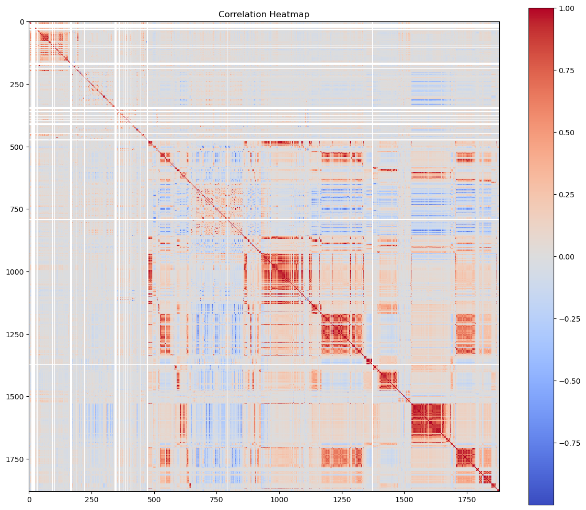

# Springleaf Marketing Response

* This repository houses an attempt to predict which customers will respond to a direct mail offer provided by Springleaf. 

## Overview

* The task is to to be able to predict whether or not a potential customer will respond to direct mail offer. Springleaf claims to provide a service to by providing them with reasonable personal and auto loans to help "take control of their lives". By scowering through anonymized data we plan to create a machine learning algorithm to make predictions to find potential clients. 
  
* The dataset for this project is extremely large so I took a sample of 1000 random correspondents. In order to keep bias at a minimum I decided to take 500 random samples of target value equaling 1 and another random 500 samples of target value equaling 0. This helped a lot when training, even though this may not be best technique it still showed better results than picking 1000 random samples. After balancing this data must be cleaned before doing anything. Once cleaned and unwanted variables are out of the way, training begins. The performance is measured using accuracy, roc-auc, and printed percentages. 

*  Highest accuracy I could acheive was 71% with a roc-auc of 0.76. It could be better...

## Summary of Workdone

### Data

* Data:
  * Type: CSV file that has been anonymized to protect customer info.
    * Input: Tons of data including state, zipcode, timestamps, etc. The columns are all named VAR_0001, VAR_0002, etc. making it really hard to know what type of data it is.
  * Size: The total size is (145231, 1934) what my computer could handle was (1000, 1934) which is still a bit large.
  * split: The full data set is unbalanced where no is the majority and yes is minority. I used an 80/20 split when training

#### Preprocessing / Clean up

* This data was very "messy", for the sample I took there were a total of 17954 total 'NaN' not count '-1','','-999999'. Another issue with replacing the alternative versions for null is some variables had -1 as a item meant to be in the data set as something other than 'NaN'. Removing duplicates was the first step, second, split the data into x (numerical and categorical) and y (target) while dropping 'ID' variable along the way. Next I changed all numeric value to float, then split categorical and numerical data into different data frames. Now that the data types are split I clip the upper and lower bound of the numeric columns to rid the data of outliers. There were columns that only contain 'NaN' those need to be dropped in order to avoid issues. Now that this is done impute, scaler, and one hot enconde all data and concatenate the results into a new data frame ready for training. 

#### Data Visualization
There are lots of numerical values that are highly correlated. This data was so large and hard to interpret due to the columns being named VAR_0001, etc.

### Problem Formulation

* Define:
  * Input: The data that was intputed was everything remaining after the cleaning. Without references are for the columns it was difficult picking specific inputs
    Output: Binary Classification (1 yes & 0 no)
  * Models: Models used are decision tree, random forest classifier, and Linear discriminant analysis.
  * Loss, Optimizer, other Hyperparameters:
    The models use accuracy as the evaluation metric as well as confusion matrix.

### Training

* Describe the training:
  * How: The model is trained using Random Forest Classifier with 100 Trees.
  * Trainin time: Training was very quick only took few minutes.
  * Stopping Criteria: The model trains until fitted.
  * Difficulties: Cleaning the data properly for better results.

### Performance Comparison
Random Forest

Decision Tree

LDA

### Conclusions

Decision tree worked the best compared to the others I used.

### Future Work

I would like to practice more on a smaller data set, I didn't realize what I was getting into. I spent a majority of the time trying to clean the data set. As I continue my Data science education I would like to come back to this data set. This data set was a challenge and tought alot and there is still many improvement I can make in order to get the desired results. 

## How to reproduce results

* In order to obtain this data you have join the competition. Link: https://www.kaggle.com/competitions/springleaf-marketing-response
   * To reproduce my results simply download spring leaf data cleaning file, and down load the data set. Once you have the data set, if your computer can not handle it you will have to sample it out using google colab or your desired choice. 
   * This data code can also be used for other set as well, there may be some tweaks that need to be made but nothing major.
* I would suggest using Jupyter only because colab will delete your files when you leave. If you have a very weak computer or no memory I would suggest using colab.

### Overview of files in repository

* Describe the directory structure, if any.
* List all relavent files and describe their role in the package.
* An example:
  * utils.py: various functions that are used in cleaning and visualizing data.
  * preprocess.ipynb: Takes input data in CSV and writes out data frame after cleanup.
  * visualization.ipynb: Creates various visualizations of the data.
  * models.py: Contains functions that build the various models.
  * training-model-1.ipynb: Trains the first model and saves model during training.
  * training-model-2.ipynb: Trains the second model and saves model during training.
  * training-model-3.ipynb: Trains the third model and saves model during training.
  * performance.ipynb: loads multiple trained models and compares results.
  * inference.ipynb: loads a trained model and applies it to test data to create kaggle submission.

* Note that all of these notebooks should contain enough text for someone to understand what is happening.

### Software Setup
* I accessed all software through libraries.
* For data understanding/processing use numpy, pandas and matplotlib.
* For training Use sklearn list of packages:
from sklearn.pipeline import Pipeline
from sklearn.impute import SimpleImputer
from sklearn.preprocessing import OneHotEncoder, StandardScaler, FunctionTransformer
from sklearn.model_selection import train_test_split
from sklearn.metrics import accuracy_score, classification_report, roc_auc_score, confusion_matrix
from sklearn.linear_model import LogisticRegression
from sklearn.tree import DecisionTreeClassifier
from sklearn.ensemble import RandomForestClassifier
from sklearn.discriminant_analysis import LinearDiscriminantAnalysis
from sklearn.feature_selection import mutual_info_classif, VarianceThreshold
from sklearn.compose import ColumnTransformer
from sklearn.metrics import roc_curve, auc

If you have any feed back or suggestions for improvement contact me at:
pms6896@mavs.uta.edu

