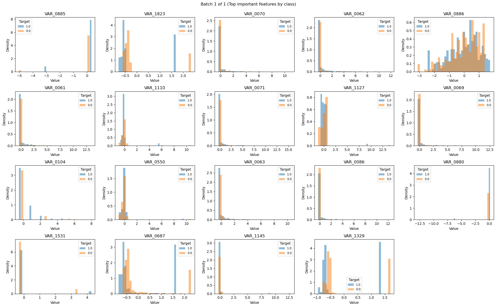
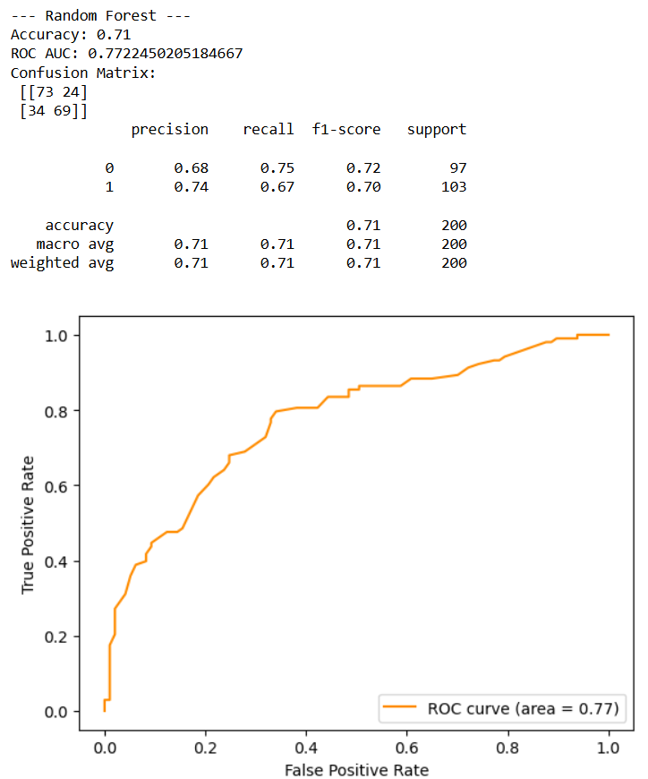
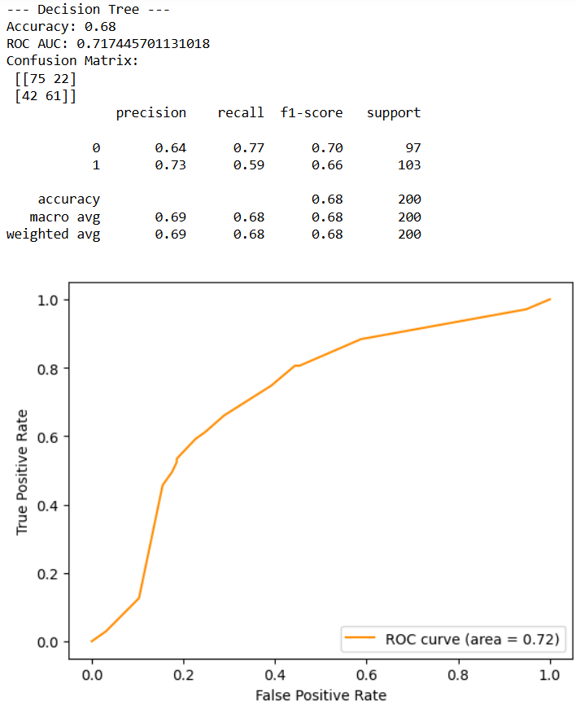
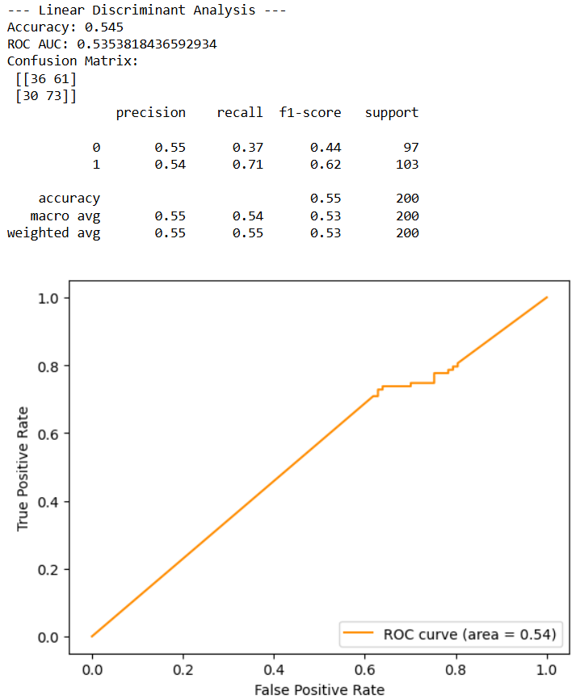

# Springleaf Marketing Response

* This repository houses an attempt to predict which customers will respond to a direct mail offer provided by Springleaf. 

## Overview

* Objective: The goal of this project is to predict whether a potential customer will respond to a direct mail offer. By analyzing anonymized customer data, the objective is to develop a machine learning model capable of identifying likely responders to such offers.
* Dataset Sampling and Preprocessing: Due to the large size of the original dataset, a random sample of 1,000 records was selected for analysis. To minimize class imbalance, the sample was stratified by selecting 500 instances with a target value of 1 (responders) and 500 with a target value of 0 (non-responders). While this method may not be the most sophisticated approach to class balancing, it provided improved results compared to purely random sampling. After sampling, extensive data cleaning was conducted to remove irrelevant or low-variance features and prepare the data for training.
* Model Training and Evaluation: A Random Forest Classifier was used for model training. Model performance was evaluated using accuracy, ROC-AUC score, and corresponding classification metrics. The best model achieved an accuracy of 71% and a ROC-AUC score of 0.76. While these results are promising, there is still room for further optimization and improvement.

## Summary of Workdone

### Data

* Data:
  Data
  *	Format: The dataset is provided as a CSV file, with all information anonymized to protect customer privacy. All column names follow a generic format (e.g., VAR_0001, VAR_0002), making it difficult to interpret the nature of the variables (e.g., demographic, transactional, etc.).
  * Features: The dataset includes a wide range of features such as location data (state, zip code), timestamps, and numerous anonymous variables.
  * Size: The full dataset consists of 145,231 rows and 1,934 columns. Due to hardware limitations, a subset of 1,000 samples was used for analysis—still a high-dimensional dataset requiring extensive preprocessing.
  * Class Imbalance: The original dataset is highly imbalanced, with non-responders significantly outnumbering responders. An 80/20 train-test split was used for model development, following the balancing strategy described earlier.
#### Preprocessing and Cleaning

The dataset required substantial preprocessing due to its size and messiness:
  * Missing Values: In the 1,000-sample subset, there were 17,954 missing values explicitly labeled as NaN, not counting other placeholders such as -1, empty strings (''), or -999999. A major challenge was that some variables used -1 as a valid value rather than a placeholder for missing data.
  * Initial Steps: The first step was removing duplicate rows. Next, the data was separated into features (X) and the target (y), with the ‘ID’ column dropped as it carried no predictive value.
  * Data Type Handling: All numeric variables were converted to float for consistency. The data was then split into separate dataframes for numerical and categorical variables.
  * Outlier Treatment: Outliers in numeric columns were mitigated by clipping values at the upper and lower bounds.
  * Column Pruning: Columns consisting entirely of missing values were dropped to prevent issues during modeling.
  * Final Preparation: Missing values were imputed, numerical data was scaled, and categorical data was one-hot encoded. The processed numerical and categorical features were then concatenated into a final dataframe, ready for training.

#### Data Visualization
This heatmap visualizes the pairwise Pearson correlation coefficients among the numerical features in the dataset:
* Observations:
* There are several dense red blocks along the diagonal, suggesting clusters of features that are highly correlated with one another. These may represent redundant or highly interdependent variables.
* Pockets of negative correlation (blue regions) are less common but still present, indicating some features move inversely with others.
* Many features are lightly colored, indicating weak or negligible correlation—typical in high-dimensional datasets with a mix of signal and noise.

Top 20 important Variables. I would show all but there are too many:

### Problem Formulation

* Define:
  * Input: The data that was intputed was everything remaining after the cleaning. Without references are for the columns it was difficult picking specific inputs
    Output: Binary Classification (1 yes & 0 no)
  * Models: Models used are decision tree, random forest classifier, and Linear discriminant analysis.
  * Loss, Optimizer, other Hyperparameters:
    The models use accuracy as the evaluation metric as well as confusion matrix.

### Training

* Describe the training:
Training
  * Approach: The model was trained using a Random Forest Classifier consisting of 100 decision trees.
  *	Training Time: Training was efficient and completed within a few minutes.
  * Stopping Criteria: The model was trained until convergence, using the default fitting process provided by the algorithm.
  * Challenges: The primary challenge was ensuring proper data cleaning and preprocessing, which was essential for improving model performance and achieving reliable results.

### Performance Comparison
Random Forest

Decision Tree

LDA

### Conclusions

Decision tree worked the best compared to the others I used.

### Future Work

In future projects, I would prefer to begin with a smaller dataset to focus more effectively on analysis and modeling. I underestimated the time and effort required for data cleaning, which took up the majority of this project. Despite the challenges, working with this dataset was a valuable learning experience that taught me a great deal about data preparation and analysis. As I progress in my data science education, I intend to revisit this dataset to apply new skills and make further improvements to achieve more accurate and insightful results.
## How to reproduce results

* In order to obtain this data you have join the competition. Link: https://www.kaggle.com/competitions/springleaf-marketing-response
   * Reproducing Results: To replicate the results, download both the Springleaf dataset and the associated data cleaning script. If your system cannot handle the full dataset due to memory constraints, consider sampling a smaller subset using Google Colab or another cloud-based environment of your choice.
   * Code Reusability: The data cleaning script is adaptable and can be reused for similar datasets. While minor adjustments may be needed depending on dataset structure, the core preprocessing logic remains applicable.
* Development Environment Recommendations:
  * Jupyter Notebook is recommended for ease of development, persistence of files, and flexibility in managing large datasets locally.
  * Google Colab is a suitable alternative for users with limited hardware resources. However, keep in mind that session data and uploaded files may be lost upon disconnection or inactivity.

### Overview of files in repository

* Relevant Files:
  *Spring Leaf Data Cleaning.ipynb
  *Spring Leaf Data Visualization.ipynb 

* Note that all of these notebooks should contain enough text for someone to understand what is happening.

### Software Setup
* I accessed all software through libraries.
* For data understanding/processing use numpy, pandas and matplotlib.
* For training Use sklearn list of packages:
from sklearn.pipeline import Pipeline
from sklearn.impute import SimpleImputer
from sklearn.preprocessing import OneHotEncoder, StandardScaler, FunctionTransformer
from sklearn.model_selection import train_test_split
from sklearn.metrics import accuracy_score, classification_report, roc_auc_score, confusion_matrix
from sklearn.linear_model import LogisticRegression
from sklearn.tree import DecisionTreeClassifier
from sklearn.ensemble import RandomForestClassifier
from sklearn.discriminant_analysis import LinearDiscriminantAnalysis
from sklearn.feature_selection import mutual_info_classif, VarianceThreshold
from sklearn.compose import ColumnTransformer
from sklearn.metrics import roc_curve, auc

If you have any feed back or suggestions for improvement contact me at:
pms6896@mavs.uta.edu

